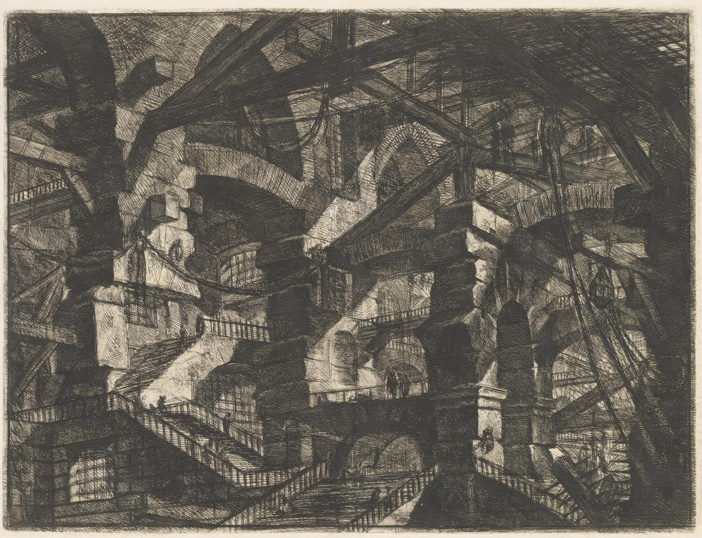

# `Piranesi` 🏛️

## Rationale

> TODO add here

## Screenshot

> TODO add here

## Disclaimer

> TODO add here

## References

The name `Piranesi` is in reference to the [18th century](https://en.wikipedia.org/wiki/1720) Italian archaeologist and architect [Giovanni Battista Piranesi](https://en.wikipedia.org/wiki/Giovanni_Battista_Piranesi), most known for his collection of 16 etchings, [Carceri d'invenzione](https://en.wikipedia.org/wiki/Carceri_d%27invenzione), often translated as [Imaginary Prisons](https://artmuseum.princeton.edu/object-package/giovanni-battista-piranesi-imaginary-prisons/3640).  

