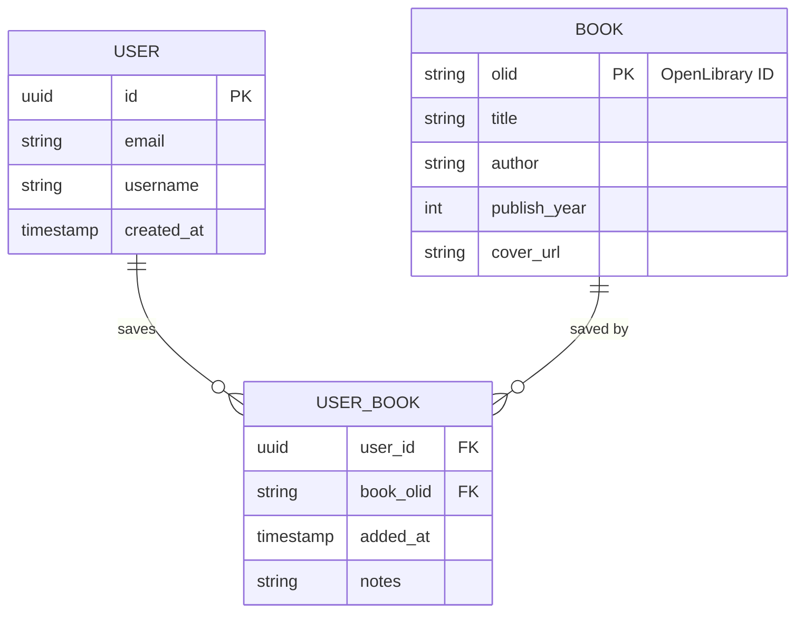
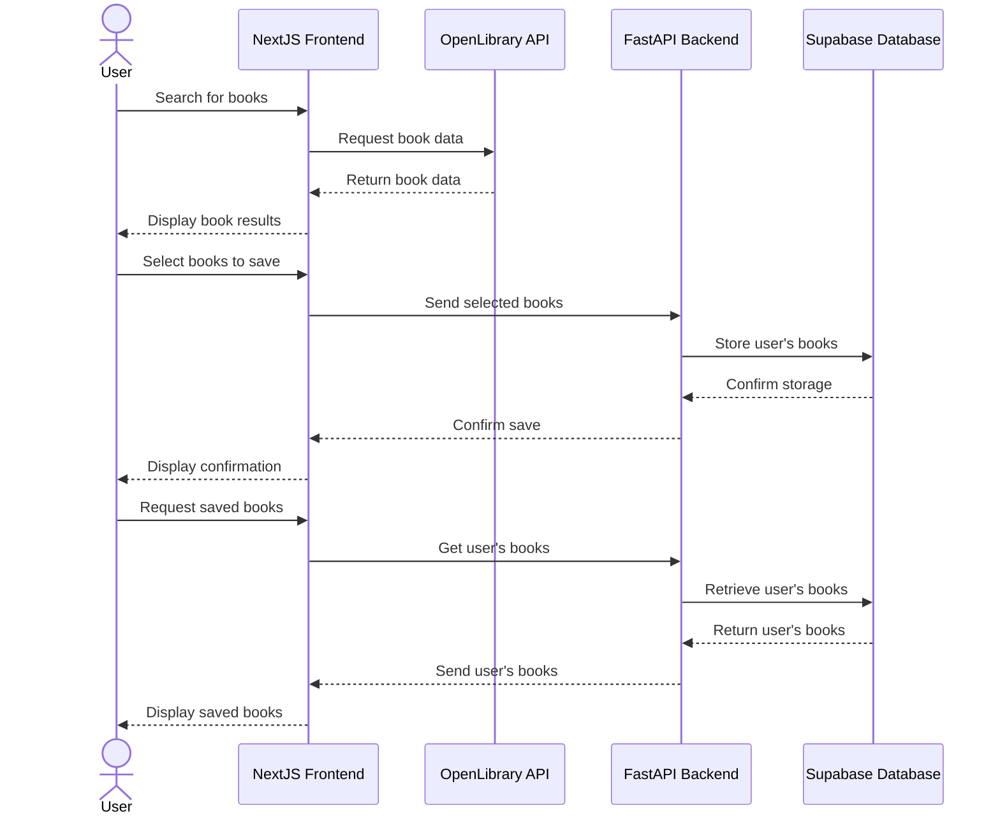

  
# `Piranesi` 🏛️

Physical book collections are awesome. Virtual libraries should be too.

## Usage

Explore the [Piranesi web app universe 🚀](./app/) by clicking below.   
  
There are currently 3 galaxies to explore. 🌌

<pre>
          <a href="./app/naive-piranesi/">naive-piranesi</a>     <a href="./app/smart-piranesi/">smart-piranesi</a>                    _______
|\   \\\\__     o                  .                      ,-~~~       ~~~-,
| \_/    o \    o                 ":"                    (  <a href="./app/chic-piranesi/">chic-piranesi</a>  )
> _   (( <_  oo                 ___:____     |"\/"|       \_-, , , , , ,-_/
| / \__+___/                  ,'        `.    \  /           / / | | \ \
|/     |/                     |  O        \___/  |           | | | | | |
                           ~^~^~^~^~^~^~^~^~^~^~^~^~         | | | | | |
                                                            / / /   \ \ \
                                                            | | |   | | |
</pre>

## Architecture 

Data is written and stored to [Supabase](https://supabase.com/) per the below schema.

### DB

### Overview

## References

The name `Piranesi` is in reference to the [18th century](https://en.wikipedia.org/wiki/1720) Italian archaeologist and architect [Giovanni Battista Piranesi](https://en.wikipedia.org/wiki/Giovanni_Battista_Piranesi), most known for his collection of 16 etchings, [Carceri d'invenzione](https://en.wikipedia.org/wiki/Carceri_d%27invenzione), often translated as [Imaginary Prisons](https://artmuseum.princeton.edu/object-package/giovanni-battista-piranesi-imaginary-prisons/3640).  

