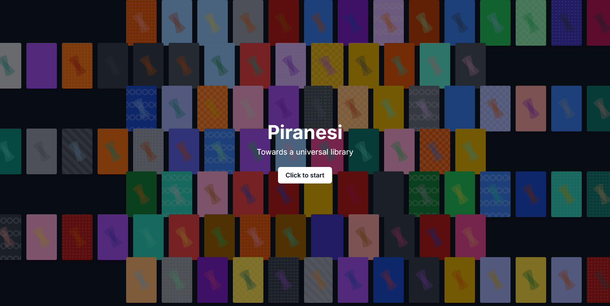
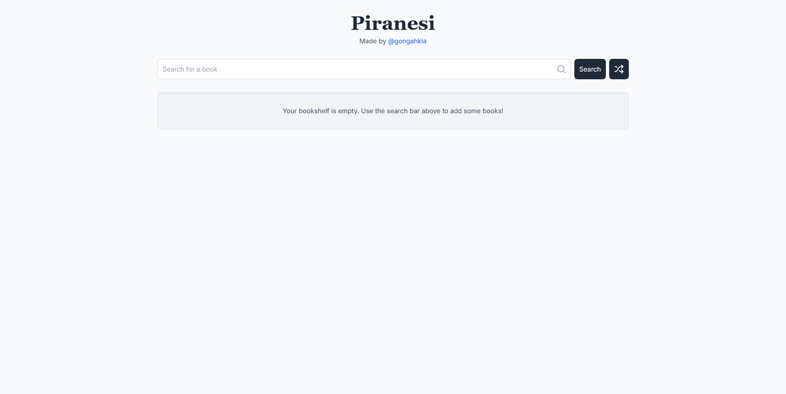
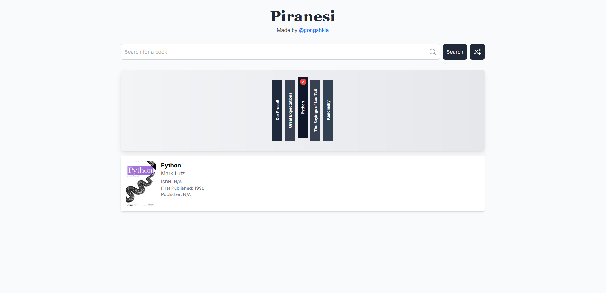

> [!WARNING]  
> Chic Piranesi's live deployment with Vercel has been discontinued for the time being.  
> Focus will be on Piranesi, the CLI application.  
> ~ Gabriel

# Chic [`Piranesi`](https://github.com/gongahkia/piranesi) web app 🧥🏛️

The world's fashionable online library.

## How to build?

To locally deploy, first run.

```console
$ cd chic-piranesi
$ npm install tailwindcss-animate
$ npm install @tanstack/react-query lucide-react
$ npm run dev
```

Then visit [`http://localhost:3000`](http://localhost:3000).

## Screenshot





