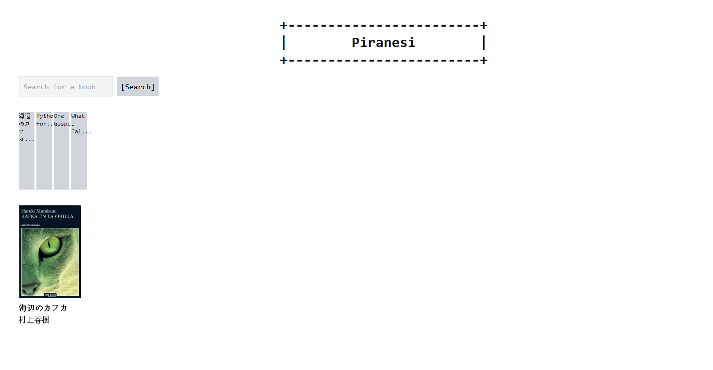
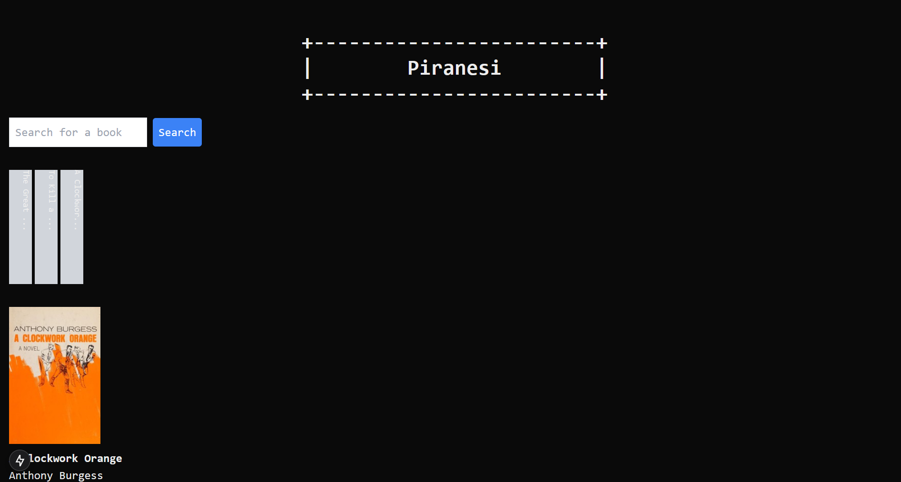

# Naive [`Piranesi`](https://github.com/gongahkia/piranesi) web app 🪅🏛️

> [!IMPORTANT]  
> Now live at [`https://naive-piranesi.vercel.app/`](https://naive-piranesi.vercel.app/).

The world's online library.

## How to build?

To locally deploy, first run.

```console
$ cd naive-piranesi
$ npm install @tanstack/react-query
$ npm run dev
```

Then visit [`http://localhost:3000`](http://localhost:3000).

## Screenshot



